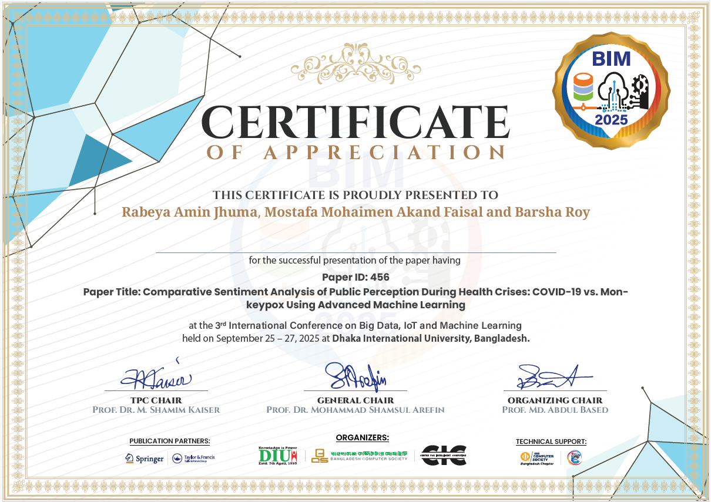

# Comparative Sentiment Analysis of Public Perception During Health Crises: COVID-19 vs. Monkeypox Using Advanced Machine Learning



---

## Summary

This repository contains the research paper and associated materials for:

**Comparative Sentiment Analysis of Public Perception During Health Crises: COVID-19 vs. Monkeypox Using Advanced Machine Learning**

Presented at the **3rd International Conference on Big Data, IoT and Machine Learning (BIM 2025)**, Dhaka International University, Bangladesh (September 25–27, 2025).

### Abstract

This study conducts a comparative sentiment analysis of public perception during COVID-19 and Monkeypox health crises using advanced machine learning techniques. We employed transformer models (XLNet and DistilRoBERTa) to analyze crisis-related Twitter data, demonstrating their superior performance over traditional ML models. The research uniquely combines sentiment analysis results with epidemiological metrics (Case Fatality Rate and Population Attributable Fraction) to provide novel insights into public fear, trust patterns, and misinformation spread during pandemics.

Our findings contribute to understanding how different health crises impact public discourse and can inform more effective crisis communication strategies for future public health emergencies.

---

## Authors

- **Rabeya Amin Jhuma**
- **Mostafa Mohaimen Akand Faisal**
- **Barsha Roy**

Published in the 3rd International Conference on Big Data, IoT and Machine Learning (BIM 2025) | **Publisher:** Taylor and Francis

---

## Conference Post

> I’m excited to share that I successfully presented my research paper:
> “Comparative Sentiment Analysis of Public Perception During Health Crises: COVID-19 vs. Monkeypox Using Advanced Machine Learning”
>
> It was an honor to present this work at the 3rd International Conference on Big Data, IoT and Machine Learning (BIM 2025), held at Dhaka International University, Bangladesh (September 25–27, 2025).
>
> In my talk, I discussed how transformer models (XLNet & DistilRoBERTa) significantly outperform traditional ML models in analyzing crisis-related Twitter data, and how combining sentiment results with epidemiological metrics (CFR & PAF) provides new insights into public fear, trust, and misinformation during pandemics.
>
> A special thanks to my supervisor & co-author Barsha Roy Krishty Mam for her continuous guidance and collaboration throughout this work.
>
> A special thanks also to my co-author Rabeya Amin Jhuma for her valuable contributions to this research.
>
> Thrilled to have received a certificate of recognition for this milestone.

---

## Citation

If you use this work, please cite:

```
Rabeya Amin Jhuma, Mostafa Mohaimen Akand Faisal and Barsha Roy. "Comparative Sentiment Analysis of Public Perception During Health Crises: COVID-19 vs. Monkeypox Using Advanced Machine Learning." 3rd International Conference on Big Data, IoT and Machine Learning (BIM 2025), Taylor and Francis.
```

---

## Hashtags

`#BIM2025` `#MachineLearning` `#BigData` `#IoT` `#NLP` `#SentimentAnalysis` `#COVID19` `#Monkeypox` `#Research` `#Conference`

---

## License

MIT License

Permission is hereby granted, free of charge, to any person obtaining a copy
of this software and associated documentation files (the "Software"), to deal
in the Software without restriction, including without limitation the rights
to use, copy, modify, merge, publish, distribute, sublicense, and/or sell
copies of the Software, and to permit persons to whom the Software is
furnished to do so, subject to the following conditions:

The above copyright notice and this permission notice shall be included in all
copies or substantial portions of the Software.

THE SOFTWARE IS PROVIDED "AS IS", WITHOUT WARRANTY OF ANY KIND, EXPRESS OR
IMPLIED, INCLUDING BUT NOT LIMITED TO THE WARRANTIES OF MERCHANTABILITY,
FITNESS FOR A PARTICULAR PURPOSE AND NONINFRINGEMENT. IN NO EVENT SHALL THE
AUTHORS OR COPYRIGHT HOLDERS BE LIABLE FOR ANY CLAIM, DAMAGES OR OTHER
LIABILITY, WHETHER IN AN ACTION OF CONTRACT, TORT OR OTHERWISE, ARISING FROM,
OUT OF OR IN CONNECTION WITH THE SOFTWARE OR THE USE OR OTHER DEALINGS IN THE
SOFTWARE.

---

## Contact

For any inquiries, reach out via [Mostafa Mohaimen Akand Faisal](https://www.linkedin.com/in/mostafa-mohaimen-akand-faisal/) or [Rabeya Amin Jhuma](https://www.linkedin.com/in/rabeya-amin-jhuma-6944b3387/), or open an issue in this repository.
